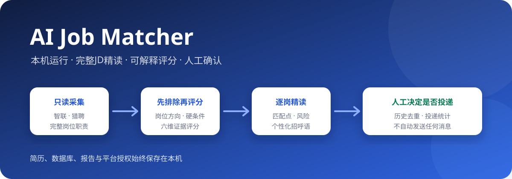
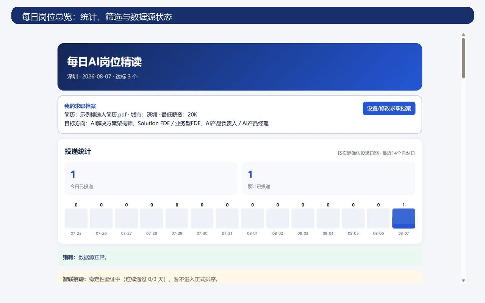
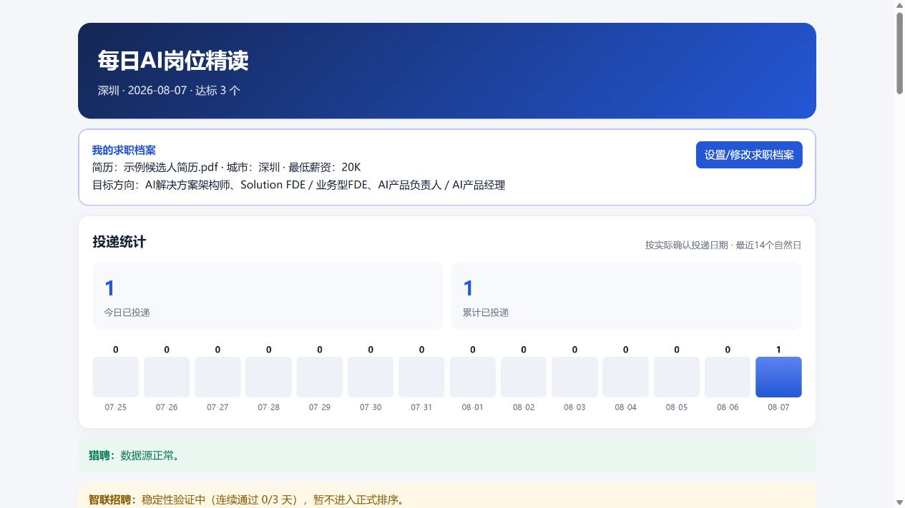
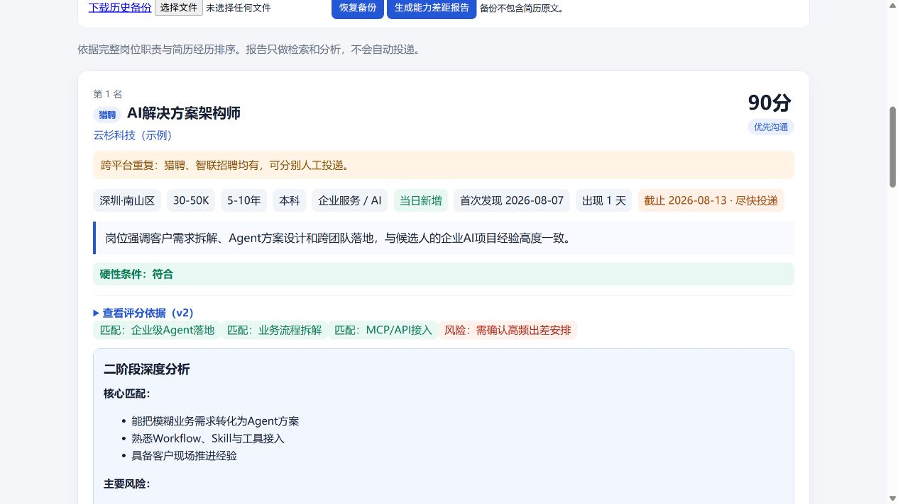
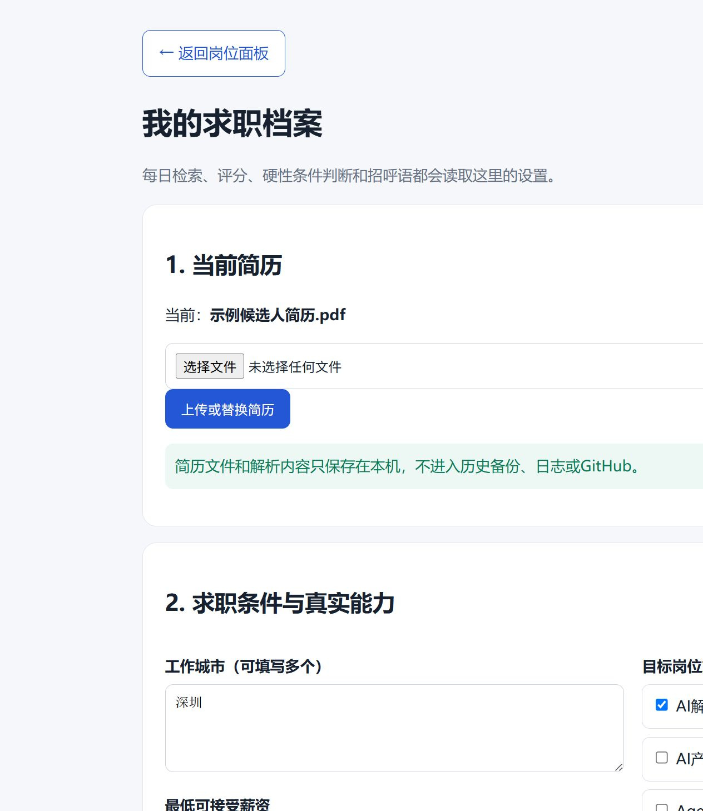

# AI Job Matcher




一个只在本机运行的 AI 岗位匹配面板：读取智联与猎聘职位，基于完整 JD 和本机简历进行硬性条件判断、可解释评分、精读排序、历史去重与投递统计。

> 只检索和分析。不会自动投递、打招呼、发送消息，也不会把简历或招聘平台登录信息上传到 GitHub。

```text
职位读取 → JD清理与硬条件判断 → 六维匹配评分 → 深度分析与招呼语 → 人工决定 → 历史去重与统计
```

## 产品演示



所有演示内容均为虚构公司、虚构岗位和示例履历，不包含真实候选人信息。

| 每日岗位总览 | 逐岗匹配分析 |
| --- | --- |
|  |  |

### 本机求职档案



首次启动后，在网页中上传简历并填写城市、目标方向、岗位月薪上限门槛和排除关键词。还可以设置严格匹配、优先／谨慎分数线、谨慎候选数量、猎头最高占比和前N名不显示猎头。该薪资门槛按岗位区间上限判断，例如30K会保留20–30K和25–40K、排除15–29K。简历文件与解析内容只保存在本机。

## 核心能力

| 能力 | 说明 |
| --- | --- |
| 双平台职位读取 | 读取智联公开职位页与猎聘只读 CLI，保留完整 JD |
| 先排除、后评分 | 非目标岗位及明确硬条件不符岗位直接进入排除区，避免通用词造成虚高分 |
| 可解释六维评分 | 展示岗位方向、核心职责、技术能力、业务领域、经验学历、地点薪资的分项证据 |
| 投递反馈管理 | 搜索已投岗位，记录六种反馈、不合适原因和HR原话，并按真实反馈复盘 |
| 个性化招呼语 | 依据岗位 JD 和本机确认的真实能力生成文案，支持复制但不自动发送 |
| 去重与历史 | 识别同平台重复发布，标记跨平台重复，并按日期保存历史报告 |
| 外包与招聘者识别 | 明确外包直接排除；区分企业招聘方、猎头和待确认，猎头使用硬指标清单话术 |
| 可配置严格模式 | 检查AI、产品、软件研发和垂直行业年限，识别纯模型工程与不完整JD |
| 猎头比例控制 | 可设置猎头最高占比及前N名无猎头；非猎头不足时宁可少展示 |
| 平台日期与本机日期 | 区分猎聘平台更新时间、本机首次收录和本机检出工作日数 |
| 人工投递记录 | 点击已投递时自动保存岗位和话术，可搜索并记录六种反馈、拒绝原因及HR原话 |
| 50份投递复盘 | 按岗位、平台、招聘者和话术类型比较响应率、有效推进率、拒绝率与面试率 |
| 工作日运行 | 可设置周一至周五上午 9 点生成报告，周末自动跳过 |
| 本机隐私保护 | 简历、数据库、报告、日志、密钥和平台授权均不进入仓库 |

## 历史记录保存在本机

岗位历史、人工投递状态、实际使用话术、招聘者判断、反馈结果和投递复盘数据保存在本机 SQLite 数据库：

```text
data/matcher.db
```

每天生成的 HTML 与 JSON 报告默认保存在 `reports/`。同一天重复运行只更新当天记录，不覆盖更早日期；面板可以按日期回看历史岗位。点击“已投递”或“不考虑”后，状态会写入数据库，关闭浏览器或重启电脑后仍然保留。

面板提供本机备份与恢复功能。备份包含岗位历史、投递记录和反馈，但不包含简历原文、平台登录信息、Cookie 或 API 密钥。`data/`、`reports/` 和备份文件均已被 Git 忽略，不会随代码上传。

投递后可在“投递管理”中记录未更新、已读未回、索要简历后无回复、沟通中、明确不合适或面试邀约。投递满3天仍未填写的岗位会进入待更新队列；选择“明确不合适”时可记录原因及HR原话，方便累计50份后复盘。

## 评分逻辑

系统先判断岗位方向与硬性条件。严格模式下还会检查AI相关年限、正式产品经历、软件研发、全栈能力、模型工程和垂直行业要求。非目标岗位，或明确要求但候选人没有证据的关键能力，会被标记为“明确不符”，不占推荐名额。

通过基本判断的岗位再按 100 分计算：

| 维度 | 分值 |
| --- | ---: |
| 岗位方向 | 30 |
| 核心职责 | 25 |
| 技术及工具能力 | 20 |
| 业务领域 | 10 |
| 经验与学历 | 10 |
| 地点与薪资 | 5 |

只有简历和 JD 中都有明确证据时才加分；未识别或未要求的维度不会自动获得满分。默认82分以上为“优先投递”，75—81分为“谨慎候选”，低于75分不占日报推荐名额。这些分数线、补充数量和猎头限制均可在“我的求职档案”中修改。

## 快速开始

需要 Python 3.11 或更高版本，以及能够在本机运行的 `liepin-cli`。本仓库不包含招聘平台账号、授权信息或第三方 CLI。

```powershell
git clone https://github.com/woshikros/ai-job-matcher.git
cd ai-job-matcher
python -m venv .venv
.\.venv\Scripts\Activate.ps1
pip install -e ".[dev]"
uvicorn job_matcher.web:app --host 127.0.0.1 --port 8000
```

打开 <http://127.0.0.1:8000/>。首次使用需要完成“我的求职档案”：

1. 上传 PDF、DOCX 或 TXT 简历。
2. 选择工作城市和一个或多个目标岗位方向。
3. 设置岗位月薪上限门槛与不考虑的岗位关键词。
4. 核对系统提取的技能、工具和项目成果。
5. 按需要调整严格模式、推荐分数线和猎头比例。

未完成简历、城市和目标方向设置时，系统允许预览面板，但不会生成正式日报。

## 生成每日报告

直接生成评分与历史报告：

```powershell
.\.venv\Scripts\python.exe -m job_matcher.daily_report `
  --resume "C:\path\to\your-resume.pdf" `
  --address 深圳 --pages 2 `
  --report-date 2026-01-01 `
  --output "reports\2026-01-01.html"
```

如需外部 AI 逐岗生成招呼语和深度分析，可先使用 `--prepare-output` 生成候选 JSON 与提示文件，再将生成结果交回报告命令进行字段、事实边界与长度校验。

## 工作日定时运行

手动运行一次工作日任务：

```powershell
.\scripts\run-weekday.ps1
```

安装周一至周五上午 9 点的 Windows 计划任务：

```powershell
.\scripts\install-weekday-task.ps1
```

周六、周日会自动跳过。也可将 `config/automation-prompt.example.md` 用作本机自动化任务说明。

## 可选 AI 分析

设置兼容 OpenAI 接口的本机环境变量后，可为评分结果补充 AI 分析。真实密钥只能放在本机环境中：

```powershell
$env:LLM_BASE_URL = "https://your-service.example/v1"
$env:LLM_API_KEY = "your-local-key"
$env:LLM_MODEL = "your-model"
```

系统会把 JD 当作不可信数据：先清理隐藏字符、控制符和残留 HTML，不执行 JD 中的指令，也不会访问正文夹带的链接。

## 数据与隐私

默认不会进入 Git 的内容包括：

- 简历及简历解析结果
- SQLite 数据库、历史报告和岗位记录
- 招呼语结果、日志与备份
- API 密钥、Cookie、平台授权和本机配置
- 虚拟环境与临时文件

发布前可运行：

```powershell
python -m pytest -q
python tools/security_checks.py --release
```

GitHub 自动测试也会执行隐私检查，防止简历、数据库、令牌、本机绝对路径或个人资料误入仓库。

## 项目边界

- 本项目仅保留只读检索、分析和人工记录能力。
- 不自动投递，不自动发送招呼语，不读取招聘聊天内容。
- 招聘网站规则与页面可能变化，请低频、合理使用，并遵守对应平台的用户协议。
- 所有评分只是辅助判断，最终是否投递由使用者决定。

## 致谢

README 的产品演示结构参考了 [BossHunter](https://github.com/powerycy/BossHunter)。本项目聚焦只读检索、岗位分析和本机历史管理，不包含自动投递、自动发送或聊天监测能力。
